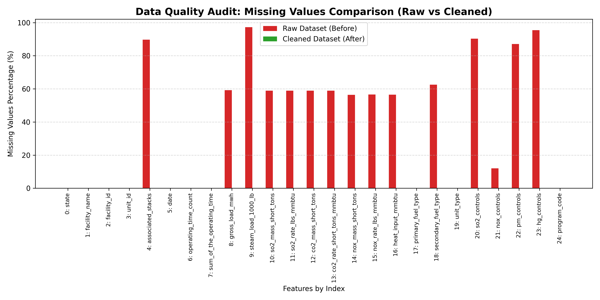

# Data Cleanliness & Profiling Report (Before vs After)

This report provides a detailed comparison of the data quality (cleanliness) of the raw daily emissions dataset versus the cleaned dataset.

## 1. Cleanliness Audit Summary Table

| Idx | Raw Feature Label | Raw Dtype | Raw Nulls (Count) | Raw Nulls (%) | Cleaned Feature Label | Cleaned Dtype | Cleaned Nulls (Count) | Cleaned Nulls (%) |
| :---: | :--- | :--- | :---: | :---: | :--- | :--- | :---: | :---: |
| 0 | `State` | str | 0 | 0.00% | `state` | str | 0 | 0.00% |
| 1 | `Facility Name` | str | 0 | 0.00% | `facility_name` | str | 0 | 0.00% |
| 2 | `Facility ID` | int64 | 0 | 0.00% | `facility_id` | int64 | 0 | 0.00% |
| 3 | `Unit ID` | str | 0 | 0.00% | `unit_id` | str | 0 | 0.00% |
| 4 | `Associated Stacks` | str | 306,450 | 89.72% | `associated_stacks` | str | 0 | 0.00% |
| 5 | `Date` | str | 0 | 0.00% | `date` | str | 0 | 0.00% |
| 6 | `Operating Time Count` | int64 | 0 | 0.00% | `operating_time_count` | int64 | 0 | 0.00% |
| 7 | `Sum of the Operating Time` | float64 | 0 | 0.00% | `sum_of_the_operating_time` | float64 | 0 | 0.00% |
| 8 | `Gross Load (MWh)` | float64 | 202,175 | 59.19% | `gross_load_mwh` | float64 | 0 | 0.00% |
| 9 | `Steam Load (1000 lb)` | float64 | 332,005 | 97.21% | `steam_load_1000_lb` | float64 | 0 | 0.00% |
| 10 | `SO2 Mass (short tons)` | float64 | 201,093 | 58.88% | `so2_mass_short_tons` | float64 | 0 | 0.00% |
| 11 | `SO2 Rate (lbs/mmBtu)` | float64 | 201,164 | 58.90% | `so2_rate_lbs_mmbtu` | float64 | 0 | 0.00% |
| 12 | `CO2 Mass (short tons)` | float64 | 201,194 | 58.91% | `co2_mass_short_tons` | float64 | 0 | 0.00% |
| 13 | `CO2 Rate (short tons/mmBtu)` | float64 | 201,245 | 58.92% | `co2_rate_short_tons_mmbtu` | float64 | 0 | 0.00% |
| 14 | `NOx Mass (short tons)` | float64 | 192,533 | 56.37% | `nox_mass_short_tons` | float64 | 0 | 0.00% |
| 15 | `NOx Rate (lbs/mmBtu)` | float64 | 193,149 | 56.55% | `nox_rate_lbs_mmbtu` | float64 | 0 | 0.00% |
| 16 | `Heat Input (mmBtu)` | float64 | 193,081 | 56.53% | `heat_input_mmbtu` | float64 | 0 | 0.00% |
| 17 | `Primary Fuel Type` | str | 0 | 0.00% | `primary_fuel_type` | str | 0 | 0.00% |
| 18 | `Secondary Fuel Type` | str | 213,480 | 62.50% | `secondary_fuel_type` | str | 0 | 0.00% |
| 19 | `Unit Type` | str | 0 | 0.00% | `unit_type` | str | 0 | 0.00% |
| 20 | `SO2 Controls` | str | 308,520 | 90.33% | `so2_controls` | str | 0 | 0.00% |
| 21 | `NOx Controls` | str | 40,950 | 11.99% | `nox_controls` | str | 0 | 0.00% |
| 22 | `PM Controls` | str | 297,540 | 87.11% | `pm_controls` | str | 0 | 0.00% |
| 23 | `Hg Controls` | str | 325,980 | 95.44% | `hg_controls` | str | 0 | 0.00% |
| 24 | `Program Code` | str | 180 | 0.05% | `program_code` | str | 0 | 0.00% |

## 2. Detailed Profiling: The Raw Dataset (Before Cleaning)

### Data Quality Issues Detected:

1. **High Rate of Missing Values**:
   - **SO2 Controls, PM Controls, Hg Controls**: Over **87% to 95%** of the rows were empty (null).
   - **Emissions & Performance metrics**: Approximately **56% to 59%** of rows were missing. This corresponds to days when power units were not operational, leaving blank fields instead of numerical zeroes.
2. **Non-Standard Column Names**:
   - Columns contained uppercase characters, spaces, and brackets/units (e.g. `Gross Load (MWh)`).

## 3. Detailed Profiling: The Cleaned Dataset (After Cleaning)

### Data Quality Enhancements Applied:

1. **Zero Null Values**: All missing values have been programmatically resolved to `'None'` for categoricals and `0.0` for numericals.
2. **Standardized Column Schemas**: Columns converted to lowercase snake_case (e.g., `gross_load_mwh`).
3. **Datatype Consistency**: Enforced explicit numeric/string formats.

## 4. Visual Comparison of Missing Values

