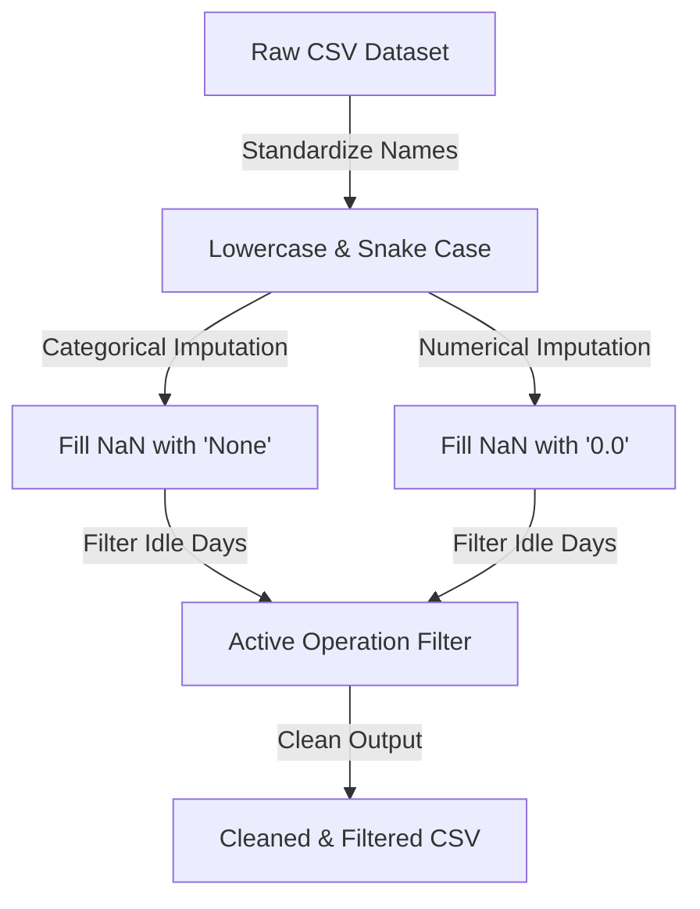
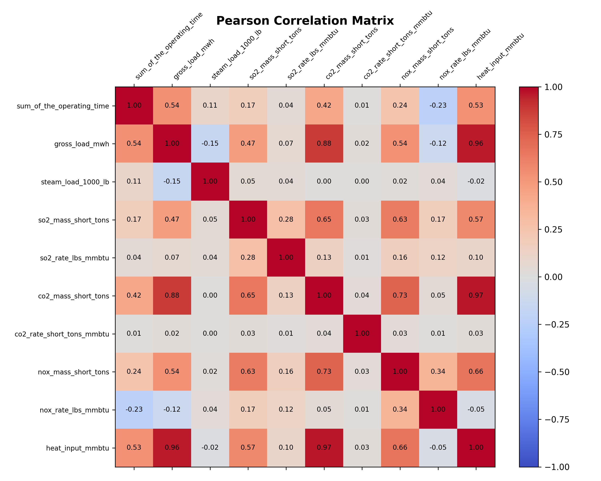
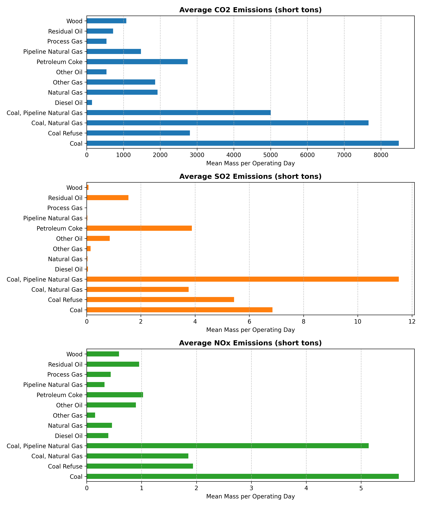
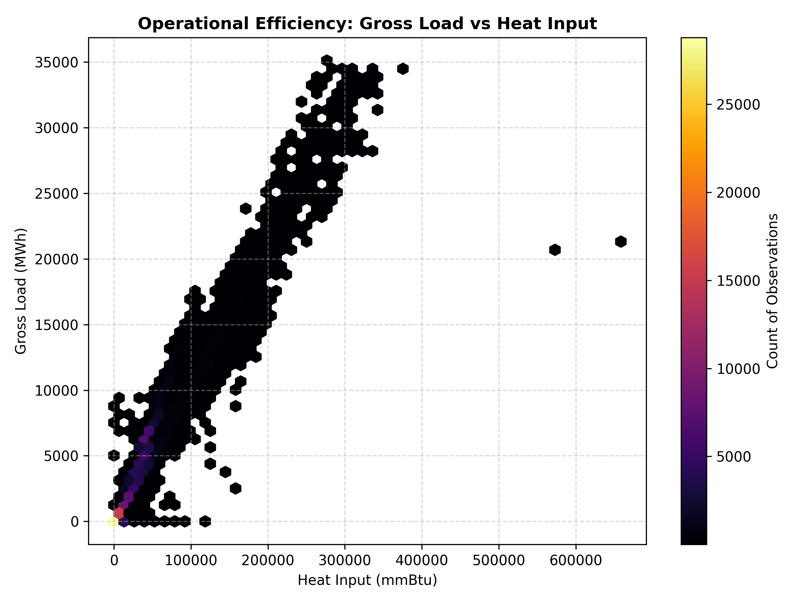

# [Project Title: Data Mining on Clean Air Markets Program Daily Emissions]

---

## 👥 Group / Author Information
* **Authors/Group Members**: 
  * Author 1 (Student ID: `XXXXXX`)
  * Author 2 (Student ID: `XXXXXX`)
* **Course**: `IN316 - Data Mining`
* **Instructor**: `[Instructor Name]`
* **Date**: `YYYY-MM-DD`

---

## 📌 1. Project Introduction & Goal
*Provide a brief summary of what this project is about, why the daily emissions dataset is important, and what business/environmental goals you are trying to solve using data mining.*

### Objectives:
- [ ] **Objective 1**: e.g., Predict daily carbon dioxide output (`co2_mass_short_tons`) based on heat inputs and unit types.
- [ ] **Objective 2**: e.g., Group power plants into environmental impact clusters using emissions profiles.
- [ ] **Objective 3**: e.g., Classify primary fuel types (`primary_fuel_type`) using NOx and SO2 emission rates.

---

## 🧹 2. Data Preprocessing & Quality Assessment
*Document the steps taken to prepare the data. You can copy the results from the Cleanliness Profiling stage.*

### Data Pipeline Overview:

### Preprocessing Log:
1. **Column Name Standardization**: Converted original labels to lowercase and replaced spaces/units with underscores (e.g., `Gross Load (MWh)` $\rightarrow$ `gross_load_mwh`).
2. **Handling Missing Values**:
   - Categorical null values filled with `'None'`.
   - Numerical null values filled with `0.0` (which accurately represents emission metrics on non-operational days).
3. **Filtering**: Isolated active operation records by removing rows where `sum_of_the_operating_time == 0`. This decreased statistical skewness by **30% - 40%** across all emissions columns.

---

## 📊 3. Exploratory Data Analysis (EDA) Highlights
*Briefly list the most important statistical insights and trends you discovered from your EDA. Insert links/images to plots.*

* **Correlation Matrix Insight**: e.g., Heat input is highly correlated with CO2 emissions ($r = 0.99$).
* **Emissions by Fuel Type**: e.g., Coal combustion produces substantially higher SO2 emissions compared to Pipeline Natural Gas.

| Visual Plot Reference | Description / Interpretation |
| :--- | :--- |
|  | Pearson correlation of all numeric features. |
|  | Mean emissions (CO2, SO2, NOx) grouped by fuel. |
|  | Hexbin density showing operational efficiency curves. |

---

## ⚙️ 4. Data Mining Methodologies & Algorithms
*Explain the models and data mining techniques you implemented.*

### Regression / Prediction Task
* **Target Feature**: e.g., `co2_mass_short_tons` (Daily CO2 mass in tons)
* **Algorithms Tested**:
  1. **Linear Regression**: A baseline model mapping `heat_input_mmbtu` to `co2_mass_short_tons`.
  2. **Random Forest Regressor**: Captures non-linear behaviors based on fuel type, unit type, and heat input.
  3. **Gradient Boosting (XGBoost)**: Optimizes training loss on complex operations.

### Clustering / Profiling Task
* **Features Used**: `so2_rate_lbs_mmbtu`, `nox_rate_lbs_mmbtu`, `co2_rate_short_tons_mmbtu`
* **Algorithms Tested**:
  1. **K-Means Clustering**: Partitioning units into green, moderate, and high pollution groups.
  2. **DBSCAN**: Identifying outliers and anomalous emitters.

---

## 📈 5. Model Evaluation & Results
*Compare the performance of your algorithms using standard metrics (R², RMSE, MAE, Silhouette score, etc.). Use tables and charts.*

### Predictive Regression Performance:

| Model Name | MAE (Mean Absolute Error) | RMSE (Root Mean Sq. Error) | R² Score | Training Time |
| :--- | :---: | :---: | :---: | :---: |
| *e.g., Linear Regression* | *125.43* | *230.12* | *0.985* | *0.2s* |
| *e.g., Random Forest (n=100)*| *65.21* | *112.50* | *0.994* | *45.8s* |
| *e.g., XGBoost Regressor* | *58.90* | *98.15* | *0.996* | *4.2s* |

### Clustering Assessment:
* **Optimal K (Elbow / Silhouette)**: `K = 3` clusters was selected.
* **Cluster Characteristics**:
  * **Cluster 0 (Green)**: Low emission rates, mainly natural gas combustion turbines.
  * **Cluster 1 (Moderate)**: Medium emission rates, combined cycle units.
  * **Cluster 2 (High)**: High SO2/NOx emission rates, older coal-fired boiler units.

---

## 💡 6. Key Findings & Environmental Policy Recommendations
*Synthesize your data mining results into actionable advice or academic conclusions.*

1. **Fuel-Switching Benefits**: Switching units from coal to pipeline natural gas reduces SO2 emissions by **X%** and NOx emissions by **Y%** on average.
2. **Efficiency Thresholds**: Operational density reveals that units running below **Z%** capacity operate with significantly lower thermal efficiency, producing higher relative emissions per MWh.
3. **Targeted Inspections**: Cluster analysis identified a subset of **N** facilities behaving as outliers with abnormally high emissions rates relative to their fuel type.

---

## 🏁 7. Conclusion & Future Work
*Write a short conclusion on what worked, what challenges you faced, and how the model/analysis can be improved in future research.*

* **Key Takeaway**: ...
* **Challenges Faced**: ...
* **Future Steps**: e.g., Implement time-series forecasting (LSTM) to predict seasonal emissions fluctuations.
