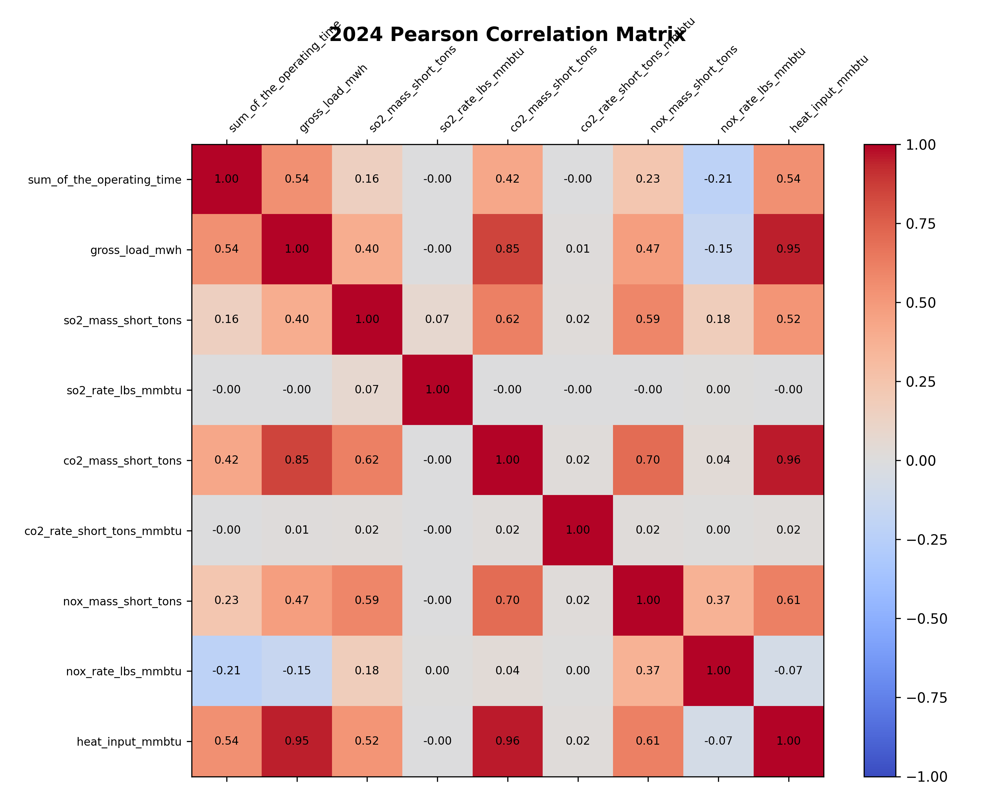
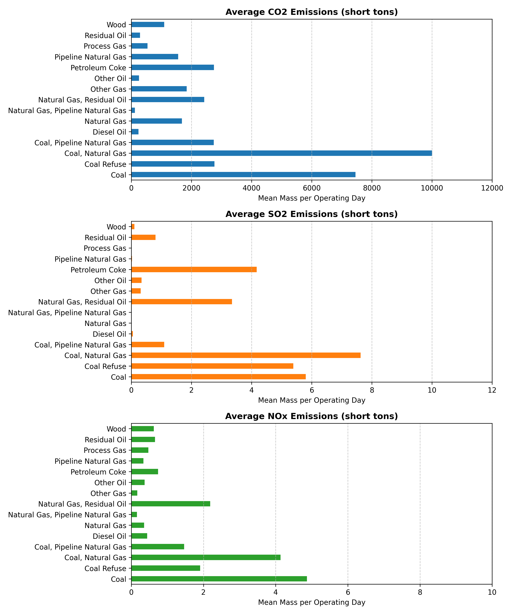
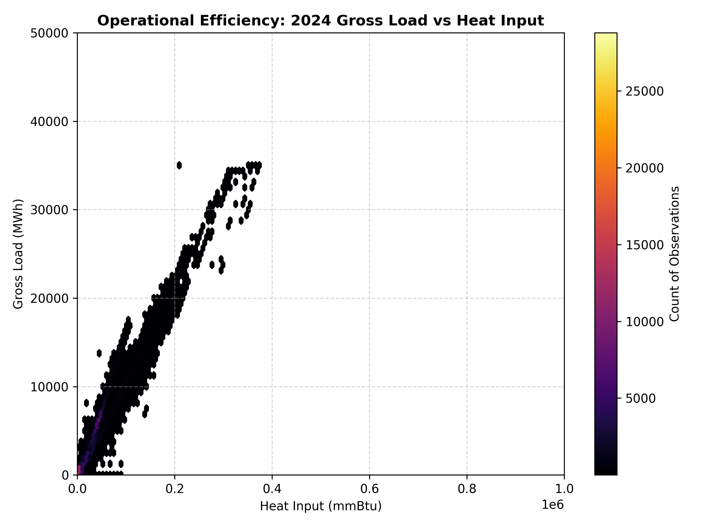

# Exploratory Data Analysis (EDA) Report (2024)

This report provides a detailed exploratory analysis of the cleaned and filtered daily emissions dataset containing active rows only for the year 2024. Visual scales are dynamically aligned across all years to support visual comparison.

## 1. Dataset Overview

- **Total Rows**: 143576
- **Total Columns**: 20

| Feature Label | Data Type | Non-Null Count | Null Count | Unique Count |
| :--- | :--- | :--- | :--- | :--- |
| `state` | str | 143576 | 0 | 49 |
| `facility_name` | str | 143576 | 0 | 1203 |
| `facility_id` | int64 | 143576 | 0 | 1205 |
| `unit_id` | str | 143576 | 0 | 1210 |
| `date` | str | 143576 | 0 | 91 |
| `operating_time_count` | int64 | 143576 | 0 | 24 |
| `sum_of_the_operating_time` | float64 | 143576 | 0 | 2385 |
| `gross_load_mwh` | float64 | 143576 | 0 | 54286 |
| `so2_mass_short_tons` | float64 | 143576 | 0 | 11026 |
| `so2_rate_lbs_mmbtu` | float64 | 143576 | 0 | 5516 |
| `co2_mass_short_tons` | float64 | 143576 | 0 | 95678 |
| `co2_rate_short_tons_mmbtu` | float64 | 143576 | 0 | 855 |
| `nox_mass_short_tons` | float64 | 143576 | 0 | 10713 |
| `nox_rate_lbs_mmbtu` | float64 | 143576 | 0 | 4795 |
| `heat_input_mmbtu` | float64 | 143576 | 0 | 136669 |
| `primary_fuel_type` | str | 143576 | 0 | 15 |
| `secondary_fuel_type` | str | 45933 | 97643 | 41 |
| `unit_type` | str | 143576 | 0 | 18 |
| `nox_controls` | str | 136983 | 6593 | 115 |
| `program_code` | str | 143576 | 0 | 56 |

## 2. Descriptive Statistics (Numerical Columns)

| Metric Feature | Mean | Std Dev | Min | 25% | 50% (Median) | 75% | 90% | 95% | 99% | Max | Skewness | Kurtosis | Variance |
| :--- | :---: | :---: | :---: | :---: | :---: | :---: | :---: | :---: | :---: | :---: | :---: | :---: | :---: |
| `sum_of_the_operating_time` | 18.72 | 8.11 | 0.01 | 13.55 | 24.00 | 24.00 | 24.00 | 24.00 | 24.00 | 24.00 | -1.16 | -0.30 | 6.58e+01 |
| `gross_load_mwh` | 4002.74 | 4013.11 | 0.00 | 456.60 | 3135.94 | 6262.00 | 9199.00 | 11870.25 | 16737.25 | 35006.00 | 1.35 | 2.76 | 1.61e+07 |
| `so2_mass_short_tons` | 1.03 | 4.14 | 0.00 | 0.00 | 0.01 | 0.02 | 2.23 | 5.88 | 22.35 | 192.27 | 7.59 | 98.42 | 1.71e+01 |
| `so2_rate_lbs_mmbtu` | 0.27 | 87.31 | 0.00 | 0.00 | 0.00 | 0.00 | 0.09 | 0.19 | 0.57 | 33082.91 | 378.91 | 143575.10 | 7.62e+03 |
| `co2_mass_short_tons` | 2527.84 | 3320.75 | 0.00 | 344.24 | 1876.19 | 2872.20 | 5558.75 | 10009.43 | 16608.17 | 38345.00 | 2.91 | 11.27 | 1.10e+07 |
| `co2_rate_short_tons_mmbtu` | 0.07 | 0.51 | 0.00 | 0.06 | 0.06 | 0.06 | 0.10 | 0.10 | 0.11 | 146.63 | 261.45 | 70140.80 | 2.64e-01 |
| `nox_mass_short_tons` | 1.11 | 2.72 | 0.00 | 0.11 | 0.21 | 0.63 | 3.18 | 5.84 | 13.23 | 77.67 | 6.08 | 67.16 | 7.42e+00 |
| `nox_rate_lbs_mmbtu` | 0.07 | 0.12 | 0.00 | 0.01 | 0.03 | 0.09 | 0.18 | 0.26 | 0.65 | 2.71 | 5.27 | 41.75 | 1.55e-02 |
| `heat_input_mmbtu` | 33816.59 | 33631.92 | 0.00 | 6977.23 | 28951.59 | 46084.75 | 72178.77 | 98688.65 | 161259.88 | 373736.20 | 1.99 | 6.73 | 1.13e+09 |

## 3. Categorical Distributions

### Distribution of `state`

| `state` Category | Count | Percentage (%) |
| :--- | :---: | :---: |
| TX | 20373.0 | 14.19% |
| FL | 9088.0 | 6.33% |
| PA | 8532.0 | 5.94% |
| CA | 7235.0 | 5.04% |
| NY | 5727.0 | 3.99% |
| OH | 5285.0 | 3.68% |
| IN | 5125.0 | 3.57% |
| MI | 4583.0 | 3.19% |
| VA | 4445.0 | 3.10% |
| AZ | 3751.0 | 2.61% |
| KY | 3392.0 | 2.36% |
| OK | 3381.0 | 2.35% |
| NC | 3352.0 | 2.33% |
| CO | 3327.0 | 2.32% |
| IL | 3318.0 | 2.31% |
| LA | 3286.0 | 2.29% |
| AL | 3255.0 | 2.27% |
| MS | 3015.0 | 2.10% |
| GA | 2916.0 | 2.03% |
| MO | 2707.0 | 1.89% |
| WI | 2647.0 | 1.84% |
| NJ | 2640.0 | 1.84% |
| NV | 2452.0 | 1.71% |
| WV | 2277.0 | 1.59% |
| SC | 2074.0 | 1.44% |
| UT | 1945.0 | 1.35% |
| TN | 1944.0 | 1.35% |
| WY | 1811.0 | 1.26% |
| AR | 1650.0 | 1.15% |
| MN | 1609.0 | 1.12% |
| MA | 1533.0 | 1.07% |
| ND | 1423.0 | 0.99% |
| MD | 1421.0 | 0.99% |
| WA | 1393.0 | 0.97% |
| KS | 1383.0 | 0.96% |
| NE | 1345.0 | 0.94% |
| NM | 1252.0 | 0.87% |
| OR | 1138.0 | 0.79% |
| CT | 1122.0 | 0.78% |
| IA | 1119.0 | 0.78% |
| MT | 672.0 | 0.47% |
| ID | 530.0 | 0.37% |
| RI | 488.0 | 0.34% |
| DE | 460.0 | 0.32% |
| SD | 382.0 | 0.27% |
| ME | 319.0 | 0.22% |
| NH | 245.0 | 0.17% |
| DC | 133.0 | 0.09% |
| VT | 76.0 | 0.05% |

### Distribution of `primary_fuel_type`

| `primary_fuel_type` Category | Count | Percentage (%) |
| :--- | :---: | :---: |
| Pipeline Natural Gas | 108158.0 | 75.33% |
| Coal | 23924.0 | 16.66% |
| Natural Gas | 5258.0 | 3.66% |
| Wood | 1551.0 | 1.08% |
| Diesel Oil | 1272.0 | 0.89% |
| Process Gas | 1221.0 | 0.85% |
| Coal Refuse | 815.0 | 0.57% |
| Other Gas | 699.0 | 0.49% |
| Residual Oil | 235.0 | 0.16% |
| Petroleum Coke | 158.0 | 0.11% |
| Natural Gas, Pipeline Natural Gas | 147.0 | 0.10% |
| Coal, Natural Gas | 53.0 | 0.04% |
| Coal, Pipeline Natural Gas | 39.0 | 0.03% |
| Other Oil | 33.0 | 0.02% |
| Natural Gas, Residual Oil | 13.0 | 0.01% |

### Distribution of `unit_type`

| `unit_type` Category | Count | Percentage (%) |
| :--- | :---: | :---: |
| Combined cycle | 71175.0 | 49.57% |
| Combustion turbine | 33852.0 | 23.58% |
| Dry bottom wall-fired boiler | 16100.0 | 11.21% |
| Tangentially-fired | 12083.0 | 8.42% |
| Circulating fluidized bed boiler | 2687.0 | 1.87% |
| Stoker | 1601.0 | 1.12% |
| Other boiler | 1473.0 | 1.03% |
| Cell burner boiler | 1327.0 | 0.92% |
| Cyclone boiler | 1290.0 | 0.90% |
| Wet bottom wall-fired boiler | 958.0 | 0.67% |
| Dry bottom turbo-fired boiler | 627.0 | 0.44% |
| Bubbling fluidized bed boiler | 174.0 | 0.12% |
| Dry bottom vertically-fired boiler | 109.0 | 0.08% |
| Integrated gasification combined cycle | 56.0 | 0.04% |
| Combustion turbine (Started Jul 01, 2024), Combined cycle (Ended Jul 01, 2024) | 23.0 | 0.02% |
| Other turbine | 20.0 | 0.01% |
| Combustion turbine (Started Jun 12, 2024), Combined cycle (Ended Jun 12, 2024) | 12.0 | 0.01% |
| Combustion turbine (Started Jan 12, 2024) | 9.0 | 0.01% |

## 4. Visualizations & Interpretations (Unified Scaling Enforced)

### A. Pearson Correlation Heatmap

### B. Emissions Profile by Fuel Type
This bar chart displays the mean emissions grouped by fuel. To avoid visual comparison distortion, the x-axis scale has been locked to a clean, rounded global maximum limit of: CO2=12000, SO2=12.0, NOx=10.0 short tons.

### C. Gross Load vs Heat Input density
This operational density hexbin plot has shared X-axis limits (0 to 1000000 mmBtu), Y-axis limits (0 to 50000 MWh), and colorbar limits (0 to 28785.0 observation count) to allow clear visualization of operational efficiency and density shifts.

