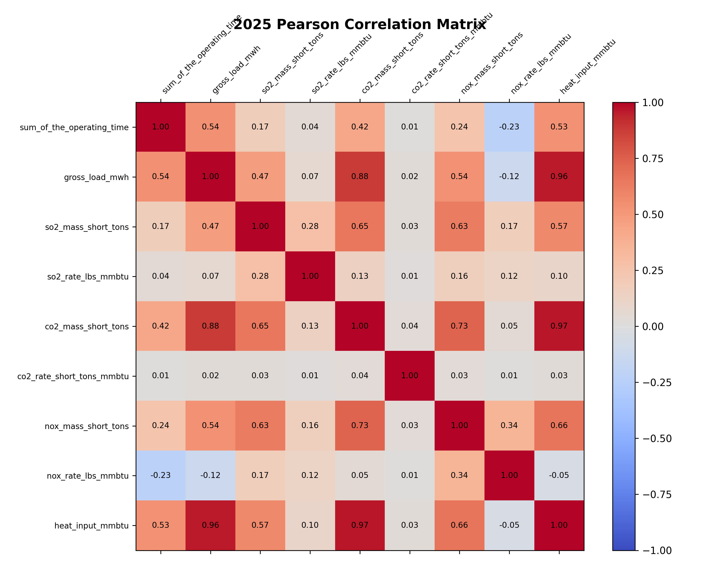
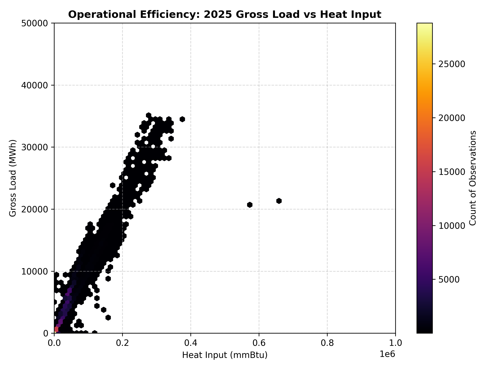

# Exploratory Data Analysis (EDA) Report (2025)

This report provides a detailed exploratory analysis of the cleaned and filtered daily emissions dataset containing active rows only for the year 2025.

## 1. Dataset Overview

- **Total Rows**: 148394
- **Total Columns**: 25

| Feature Label | Data Type | Non-Null Count | Null Count | Unique Count |
| :--- | :--- | :--- | :--- | :--- |
| `state` | str | 148394 | 0 | 49 |
| `facility_name` | str | 148394 | 0 | 1204 |
| `facility_id` | int64 | 148394 | 0 | 1205 |
| `unit_id` | str | 148394 | 0 | 1218 |
| `associated_stacks` | str | 13869 | 134525 | 72 |
| `date` | str | 148394 | 0 | 90 |
| `operating_time_count` | int64 | 148394 | 0 | 24 |
| `sum_of_the_operating_time` | float64 | 148394 | 0 | 2383 |
| `gross_load_mwh` | float64 | 148394 | 0 | 57397 |
| `steam_load_1000_lb` | float64 | 148394 | 0 | 6925 |
| `so2_mass_short_tons` | float64 | 148394 | 0 | 12435 |
| `so2_rate_lbs_mmbtu` | float64 | 148394 | 0 | 5717 |
| `co2_mass_short_tons` | float64 | 148394 | 0 | 100376 |
| `co2_rate_short_tons_mmbtu` | float64 | 148394 | 0 | 892 |
| `nox_mass_short_tons` | float64 | 148394 | 0 | 11900 |
| `nox_rate_lbs_mmbtu` | float64 | 148394 | 0 | 5082 |
| `heat_input_mmbtu` | float64 | 148394 | 0 | 141162 |
| `primary_fuel_type` | str | 148394 | 0 | 13 |
| `secondary_fuel_type` | str | 50708 | 97686 | 38 |
| `unit_type` | str | 148394 | 0 | 16 |
| `so2_controls` | str | 23418 | 124976 | 13 |
| `nox_controls` | str | 140467 | 7927 | 114 |
| `pm_controls` | str | 29229 | 119165 | 24 |
| `hg_controls` | str | 11701 | 136693 | 16 |
| `program_code` | str | 148394 | 0 | 57 |

## 2. Descriptive Statistics (Numerical Columns)

| Metric Feature | Mean | Std Dev | Min | 25% | 50% (Median) | 75% | 90% | 95% | 99% | Max | Skewness | Kurtosis | Variance |
| :--- | :---: | :---: | :---: | :---: | :---: | :---: | :---: | :---: | :---: | :---: | :---: | :---: | :---: |
| `sum_of_the_operating_time` | 18.27 | 8.31 | 0.01 | 10.92 | 24.00 | 24.00 | 24.00 | 24.00 | 24.00 | 24.00 | -1.02 | -0.64 | 6.90e+01 |
| `gross_load_mwh` | 4038.23 | 4306.55 | 0.00 | 388.85 | 2876.00 | 6213.00 | 9748.00 | 12627.35 | 18214.07 | 35108.00 | 1.59 | 3.77 | 1.85e+07 |
| `steam_load_1000_lb` | 493.27 | 3100.81 | 0.00 | 0.00 | 0.00 | 0.00 | 0.00 | 2002.35 | 10536.28 | 66614.00 | 10.71 | 141.36 | 9.62e+06 |
| `so2_mass_short_tons` | 1.24 | 4.81 | 0.00 | 0.00 | 0.01 | 0.02 | 2.78 | 7.26 | 26.86 | 86.31 | 6.37 | 51.30 | 2.32e+01 |
| `so2_rate_lbs_mmbtu` | 0.04 | 0.32 | 0.00 | 0.00 | 0.00 | 0.00 | 0.10 | 0.21 | 0.56 | 74.20 | 153.62 | 31157.27 | 9.99e-02 |
| `co2_mass_short_tons` | 2670.27 | 3761.97 | 0.00 | 308.86 | 1751.35 | 2878.07 | 6487.04 | 11578.38 | 18002.99 | 67582.10 | 2.93 | 11.14 | 1.42e+07 |
| `co2_rate_short_tons_mmbtu` | 0.07 | 0.35 | 0.00 | 0.06 | 0.06 | 0.06 | 0.10 | 0.10 | 0.11 | 135.80 | 381.71 | 146585.14 | 1.25e-01 |
| `nox_mass_short_tons` | 1.26 | 3.12 | 0.00 | 0.11 | 0.21 | 0.67 | 3.74 | 6.72 | 15.71 | 81.29 | 5.11 | 38.77 | 9.73e+00 |
| `nox_rate_lbs_mmbtu` | 0.08 | 0.13 | 0.00 | 0.01 | 0.04 | 0.10 | 0.19 | 0.29 | 0.67 | 2.71 | 5.11 | 42.16 | 1.71e-02 |
| `heat_input_mmbtu` | 34648.94 | 37159.42 | 0.00 | 6366.26 | 27580.78 | 45944.88 | 76263.47 | 112634.90 | 172757.74 | 658694.50 | 2.20 | 7.73 | 1.38e+09 |

## 3. Categorical Distributions

### Distribution of `state`

| `state` Category | Count | Percentage (%) |
| :--- | :---: | :---: |
| TX | 21231.0 | 14.31% |
| FL | 9464.0 | 6.38% |
| PA | 8938.0 | 6.02% |
| NY | 7000.0 | 4.72% |
| CA | 6429.0 | 4.33% |
| OH | 5381.0 | 3.63% |
| IN | 5085.0 | 3.43% |
| VA | 4828.0 | 3.25% |
| MI | 4772.0 | 3.22% |
| IL | 3891.0 | 2.62% |
| AL | 3819.0 | 2.57% |
| KY | 3745.0 | 2.52% |
| NC | 3667.0 | 2.47% |
| AZ | 3623.0 | 2.44% |
| OK | 3494.0 | 2.35% |
| CO | 3412.0 | 2.30% |
| LA | 3377.0 | 2.28% |
| MS | 3292.0 | 2.22% |
| GA | 3079.0 | 2.07% |
| WI | 2787.0 | 1.88% |
| NJ | 2687.0 | 1.81% |
| MO | 2673.0 | 1.80% |
| SC | 2315.0 | 1.56% |
| TN | 2244.0 | 1.51% |
| NV | 2237.0 | 1.51% |
| WV | 2018.0 | 1.36% |
| UT | 1913.0 | 1.29% |
| WY | 1855.0 | 1.25% |
| MA | 1680.0 | 1.13% |
| AR | 1577.0 | 1.06% |
| MD | 1577.0 | 1.06% |
| NE | 1403.0 | 0.95% |
| KS | 1386.0 | 0.93% |
| ND | 1368.0 | 0.92% |
| CT | 1338.0 | 0.90% |
| MN | 1221.0 | 0.82% |
| IA | 1167.0 | 0.79% |
| NM | 1091.0 | 0.74% |
| WA | 1067.0 | 0.72% |
| OR | 855.0 | 0.58% |
| MT | 644.0 | 0.43% |
| DE | 591.0 | 0.40% |
| RI | 590.0 | 0.40% |
| ID | 428.0 | 0.29% |
| SD | 346.0 | 0.23% |
| NH | 310.0 | 0.21% |
| ME | 265.0 | 0.18% |
| DC | 155.0 | 0.10% |
| VT | 79.0 | 0.05% |

### Distribution of `primary_fuel_type`

| `primary_fuel_type` Category | Count | Percentage (%) |
| :--- | :---: | :---: |
| Pipeline Natural Gas | 111064.0 | 74.84% |
| Coal | 25230.0 | 17.00% |
| Natural Gas | 5279.0 | 3.56% |
| Diesel Oil | 1771.0 | 1.19% |
| Wood | 1529.0 | 1.03% |
| Process Gas | 1229.0 | 0.83% |
| Coal Refuse | 732.0 | 0.49% |
| Other Gas | 593.0 | 0.40% |
| Residual Oil | 385.0 | 0.26% |
| Coal, Pipeline Natural Gas | 251.0 | 0.17% |
| Petroleum Coke | 208.0 | 0.14% |
| Other Oil | 72.0 | 0.05% |
| Coal, Natural Gas | 51.0 | 0.03% |

### Distribution of `unit_type`

| `unit_type` Category | Count | Percentage (%) |
| :--- | :---: | :---: |
| Combined cycle | 70400.0 | 47.44% |
| Combustion turbine | 36789.0 | 24.79% |
| Dry bottom wall-fired boiler | 17040.0 | 11.48% |
| Tangentially-fired | 13067.0 | 8.81% |
| Circulating fluidized bed boiler | 2811.0 | 1.89% |
| Stoker | 1559.0 | 1.05% |
| Cyclone boiler | 1550.0 | 1.04% |
| Cell burner boiler | 1482.0 | 1.00% |
| Other boiler | 1440.0 | 0.97% |
| Wet bottom wall-fired boiler | 1011.0 | 0.68% |
| Dry bottom turbo-fired boiler | 738.0 | 0.50% |
| Bubbling fluidized bed boiler | 181.0 | 0.12% |
| Integrated gasification combined cycle | 180.0 | 0.12% |
| Dry bottom vertically-fired boiler | 133.0 | 0.09% |
| Integrated gasification combined cycle (Ended Jun 07, 2025), Combustion turbine (Started Jun 07, 2025) | 8.0 | 0.01% |
| Other turbine | 5.0 | 0.00% |

## 4. Visualizations & Interpretations

### A. Pearson Correlation Heatmap

### B. Emissions Profile by Fuel Type

### C. Gross Load vs Heat Input density

