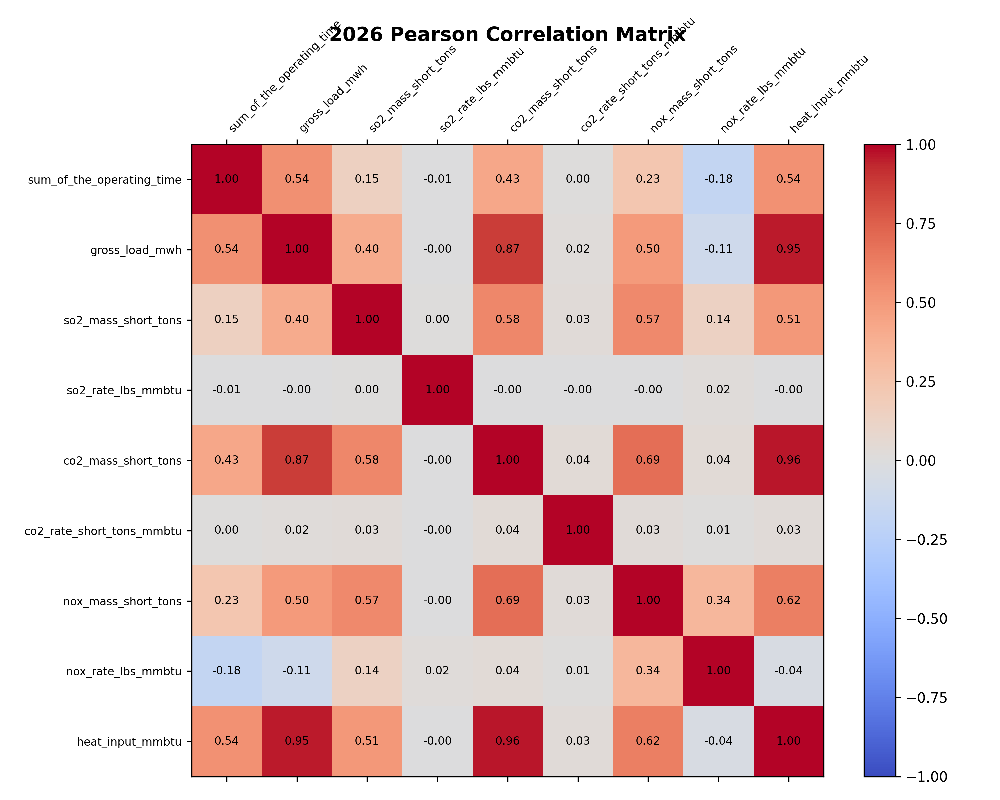
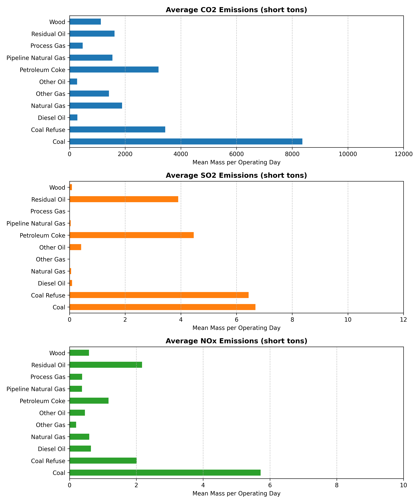
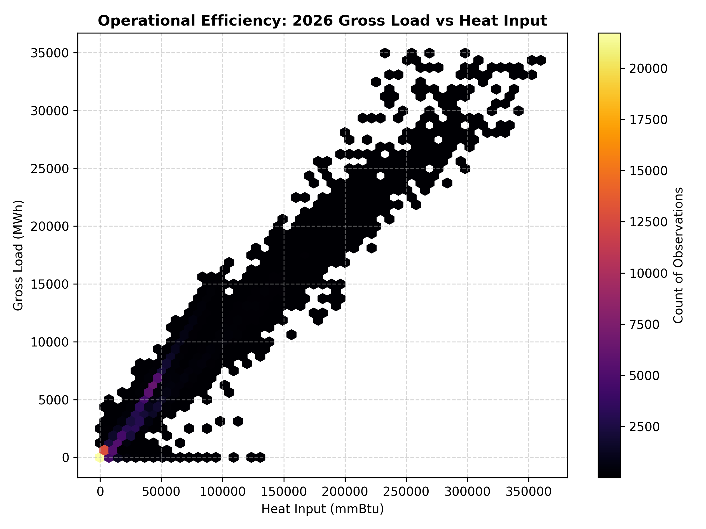

# Exploratory Data Analysis (EDA) Report (2026)

This report provides a detailed exploratory analysis of the cleaned and filtered daily emissions dataset containing active rows only for the year 2026.

## 1. Dataset Overview

- **Total Rows**: 145093
- **Total Columns**: 25

| Feature Label | Data Type | Non-Null Count | Null Count | Unique Count |
| :--- | :--- | :--- | :--- | :--- |
| `state` | str | 145093 | 0 | 49 |
| `facility_name` | str | 145093 | 0 | 1188 |
| `facility_id` | int64 | 145093 | 0 | 1190 |
| `unit_id` | str | 145093 | 0 | 1219 |
| `associated_stacks` | str | 12233 | 132860 | 70 |
| `date` | str | 145093 | 0 | 90 |
| `operating_time_count` | int64 | 145093 | 0 | 24 |
| `sum_of_the_operating_time` | float64 | 145093 | 0 | 2379 |
| `gross_load_mwh` | float64 | 145093 | 0 | 56984 |
| `steam_load_1000_lb` | float64 | 145093 | 0 | 6521 |
| `so2_mass_short_tons` | float64 | 145093 | 0 | 11483 |
| `so2_rate_lbs_mmbtu` | float64 | 145093 | 0 | 5498 |
| `co2_mass_short_tons` | float64 | 145093 | 0 | 98419 |
| `co2_rate_short_tons_mmbtu` | float64 | 145093 | 0 | 806 |
| `nox_mass_short_tons` | float64 | 145093 | 0 | 11635 |
| `nox_rate_lbs_mmbtu` | float64 | 145093 | 0 | 5098 |
| `heat_input_mmbtu` | float64 | 145093 | 0 | 138433 |
| `primary_fuel_type` | str | 145093 | 0 | 11 |
| `secondary_fuel_type` | str | 50120 | 94973 | 38 |
| `unit_type` | str | 145093 | 0 | 15 |
| `so2_controls` | str | 21156 | 123937 | 12 |
| `nox_controls` | str | 137616 | 7477 | 109 |
| `pm_controls` | str | 26593 | 118500 | 22 |
| `hg_controls` | str | 10451 | 134642 | 14 |
| `program_code` | str | 145093 | 0 | 56 |

## 2. Descriptive Statistics (Numerical Columns)

| Metric Feature | Mean | Std Dev | Min | 25% | 50% (Median) | 75% | 90% | 95% | 99% | Max | Skewness | Kurtosis | Variance |
| :--- | :---: | :---: | :---: | :---: | :---: | :---: | :---: | :---: | :---: | :---: | :---: | :---: | :---: |
| `sum_of_the_operating_time` | 18.36 | 8.21 | 0.01 | 11.17 | 24.00 | 24.00 | 24.00 | 24.00 | 24.00 | 24.00 | -1.03 | -0.60 | 6.74e+01 |
| `gross_load_mwh` | 4016.66 | 4193.81 | 0.00 | 458.36 | 2948.70 | 6234.00 | 9444.80 | 12180.00 | 17762.16 | 34960.00 | 1.58 | 3.87 | 1.76e+07 |
| `steam_load_1000_lb` | 494.16 | 3270.53 | 0.00 | 0.00 | 0.00 | 0.00 | 0.00 | 1638.40 | 12603.72 | 70853.00 | 10.89 | 143.55 | 1.07e+07 |
| `so2_mass_short_tons` | 1.13 | 5.00 | 0.00 | 0.00 | 0.01 | 0.02 | 2.31 | 6.46 | 25.29 | 400.48 | 15.42 | 673.72 | 2.50e+01 |
| `so2_rate_lbs_mmbtu` | 0.29 | 98.72 | 0.00 | 0.00 | 0.00 | 0.00 | 0.09 | 0.19 | 0.55 | 37603.40 | 380.91 | 145091.35 | 9.75e+03 |
| `co2_mass_short_tons` | 2604.88 | 3575.85 | 0.00 | 349.65 | 1793.40 | 2905.30 | 5818.40 | 10747.90 | 17334.65 | 37295.00 | 3.00 | 11.67 | 1.28e+07 |
| `co2_rate_short_tons_mmbtu` | 0.07 | 0.33 | 0.00 | 0.06 | 0.06 | 0.06 | 0.10 | 0.10 | 0.11 | 122.80 | 346.02 | 125400.41 | 1.12e-01 |
| `nox_mass_short_tons` | 1.24 | 3.12 | 0.00 | 0.11 | 0.22 | 0.67 | 3.66 | 6.67 | 15.23 | 147.20 | 6.57 | 101.20 | 9.71e+00 |
| `nox_rate_lbs_mmbtu` | 0.08 | 0.16 | 0.00 | 0.01 | 0.04 | 0.09 | 0.18 | 0.27 | 0.70 | 30.30 | 53.57 | 9785.79 | 2.43e-02 |
| `heat_input_mmbtu` | 34501.40 | 35894.60 | 0.00 | 6822.10 | 28280.53 | 46454.72 | 74590.42 | 106352.04 | 168352.82 | 363498.40 | 2.17 | 7.45 | 1.29e+09 |

## 3. Categorical Distributions

### Distribution of `state`

| `state` Category | Count | Percentage (%) |
| :--- | :---: | :---: |
| TX | 19115.0 | 13.17% |
| FL | 9563.0 | 6.59% |
| PA | 8642.0 | 5.96% |
| NY | 7163.0 | 4.94% |
| IN | 5601.0 | 3.86% |
| OH | 5585.0 | 3.85% |
| MI | 5246.0 | 3.62% |
| CA | 5160.0 | 3.56% |
| VA | 4771.0 | 3.29% |
| NC | 4154.0 | 2.86% |
| IL | 4096.0 | 2.82% |
| KY | 3666.0 | 2.53% |
| LA | 3486.0 | 2.40% |
| AL | 3438.0 | 2.37% |
| GA | 3354.0 | 2.31% |
| AZ | 3134.0 | 2.16% |
| MS | 3102.0 | 2.14% |
| NJ | 3096.0 | 2.13% |
| CO | 3045.0 | 2.10% |
| OK | 2915.0 | 2.01% |
| WI | 2886.0 | 1.99% |
| MO | 2858.0 | 1.97% |
| SC | 2703.0 | 1.86% |
| TN | 2346.0 | 1.62% |
| NV | 2094.0 | 1.44% |
| WV | 1896.0 | 1.31% |
| AR | 1851.0 | 1.28% |
| UT | 1750.0 | 1.21% |
| MA | 1690.0 | 1.16% |
| MD | 1655.0 | 1.14% |
| ND | 1635.0 | 1.13% |
| WY | 1520.0 | 1.05% |
| MN | 1423.0 | 0.98% |
| CT | 1402.0 | 0.97% |
| IA | 1241.0 | 0.86% |
| NE | 1158.0 | 0.80% |
| KS | 1153.0 | 0.79% |
| NM | 1111.0 | 0.77% |
| OR | 802.0 | 0.55% |
| DE | 579.0 | 0.40% |
| MT | 497.0 | 0.34% |
| RI | 491.0 | 0.34% |
| SD | 444.0 | 0.31% |
| ID | 355.0 | 0.24% |
| ME | 351.0 | 0.24% |
| NH | 348.0 | 0.24% |
| WA | 249.0 | 0.17% |
| DC | 163.0 | 0.11% |
| VT | 110.0 | 0.08% |

### Distribution of `primary_fuel_type`

| `primary_fuel_type` Category | Count | Percentage (%) |
| :--- | :---: | :---: |
| Pipeline Natural Gas | 110478.0 | 76.14% |
| Coal | 22821.0 | 15.73% |
| Natural Gas | 4785.0 | 3.30% |
| Diesel Oil | 2292.0 | 1.58% |
| Wood | 1541.0 | 1.06% |
| Process Gas | 1203.0 | 0.83% |
| Other Gas | 635.0 | 0.44% |
| Coal Refuse | 602.0 | 0.41% |
| Residual Oil | 416.0 | 0.29% |
| Petroleum Coke | 194.0 | 0.13% |
| Other Oil | 126.0 | 0.09% |

### Distribution of `unit_type`

| `unit_type` Category | Count | Percentage (%) |
| :--- | :---: | :---: |
| Combined cycle | 68277.0 | 47.06% |
| Combustion turbine | 38121.0 | 26.27% |
| Dry bottom wall-fired boiler | 15867.0 | 10.94% |
| Tangentially-fired | 12462.0 | 8.59% |
| Circulating fluidized bed boiler | 2390.0 | 1.65% |
| Stoker | 1586.0 | 1.09% |
| Cyclone boiler | 1472.0 | 1.01% |
| Other boiler | 1397.0 | 0.96% |
| Cell burner boiler | 1389.0 | 0.96% |
| Wet bottom wall-fired boiler | 978.0 | 0.67% |
| Dry bottom turbo-fired boiler | 592.0 | 0.41% |
| Bubbling fluidized bed boiler | 250.0 | 0.17% |
| Integrated gasification combined cycle | 180.0 | 0.12% |
| Dry bottom vertically-fired boiler | 127.0 | 0.09% |
| Other turbine | 5.0 | 0.00% |

## 4. Visualizations & Interpretations

### A. Pearson Correlation Heatmap

### B. Emissions Profile by Fuel Type

### C. Gross Load vs Heat Input density

